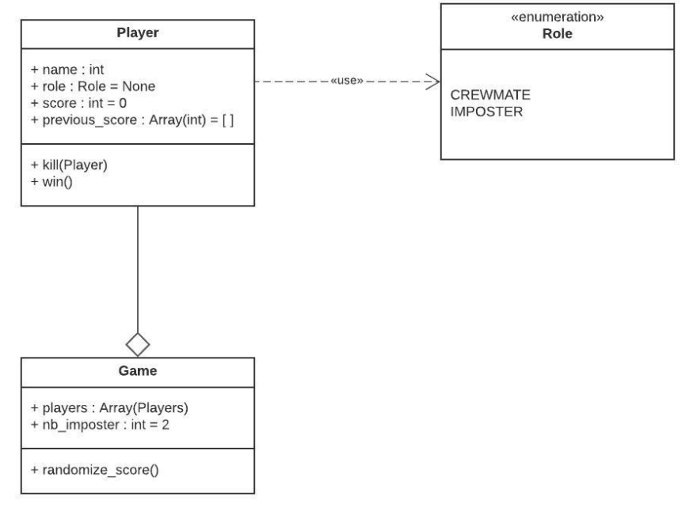
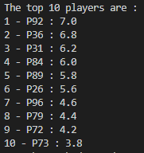
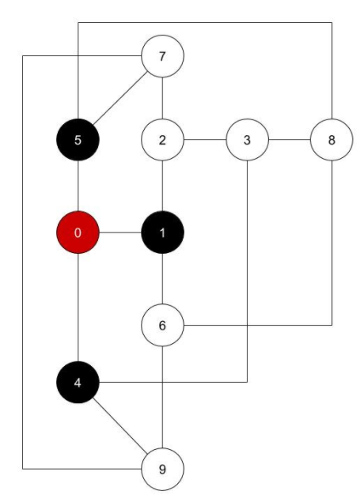
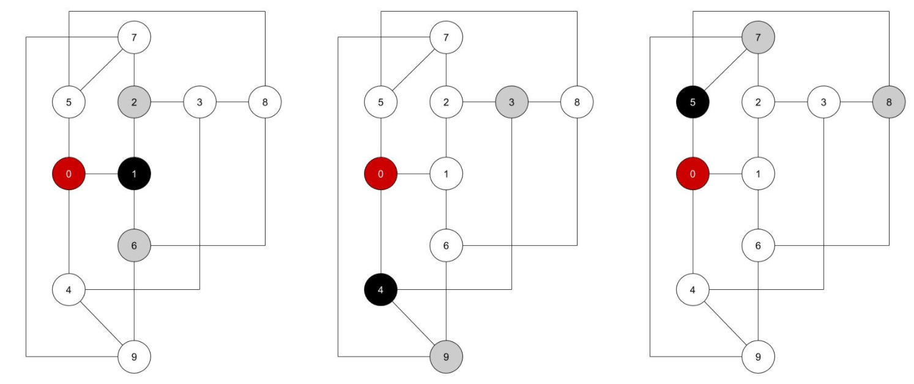
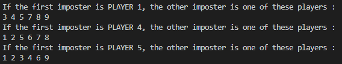
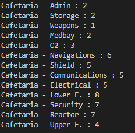
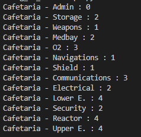
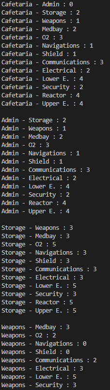
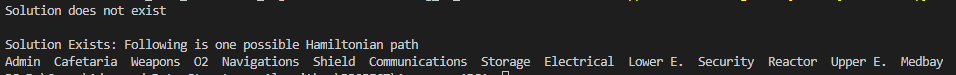

# Among us Mini-Problem

12/2020 - ESILV - Advanced Data Structures and Algortihms : Among-us mini-problem

Kévin CELIE  
Mariyam CHEICK ISMAIL  
ESILV-4-S7-CORE-DIA2

<a href="./CELIE_CHEICK-ISMAIL_Among_Us_Report.pdf" download>Click here to download the pdf version of this report. </a>

## Table of contents

-   [Step 1 : To organize the tournament](https://github.com/m-cheicki/Among_us_ADSA#step-1--to-organize-the-tournament)
-   [Step 2 : Professor Layton < Guybrush Threepwood < You](https://github.com/m-cheicki/Among_us_ADSA#step-2--professor-layton--guybrush-threepwood--you)
-   [Step 3 : I don't see him, but I can give proofs he vents! ](https://github.com/m-cheicki/Among_us_ADSA#step-3--i-dont-see-him-but-i-can-give-proofs-he-vents)
-   [Step 4 : Secure the last tasks](https://github.com/m-cheicki/Among_us_ADSA#step-4--secure-the-last-tasks)

## Step 1 : To organize the tournament

Zerator asks you to organize the next “Among Us” tournament for the next ZLAN. Please discover in a short video the game Among us.

The rules are as following:

-   Total of 100 players
-   10 players per game
-   3 random games then
-   each game regroups the players by a batch of ten following their ranking.
    -   The last 10 players (in the ranking) are ejected to the tournament.
    -   Do it until it remains only 10 players
        For the last 10 players, play 5 games with reinitiated ranking. Update and check the ranking of the 10 players and give the podium.

Here is the ranking model:

-   Impostor: 1pts per kill, 3pts per undiscovered murder, 10pts if win
-   Crewmate: 3pts if the argument unmasks an imposter, 1pts if all solo tasks are made, 5pts if win

Each time a game ended, the score of each player is the mean of all its games.

The players are stored in a structured database with a log complexity to reach an element which corresponds to a score (the most optimized structure presented in the ADSA Course).

**Argue about the question, present the code and display the results.**

1. Propose a data structure to represent a Player and its Score

To represent the Player, we choose to create an object Player, with his name to identify him, his role in the game he is currently playing, his score in the current game, and also an array with all his previous scores in the previous game.

Each game should contain 10 players. 
We assume that there are two imposters by default.

2. Propose a most optimized data structures for the tournament (called database in the following questions)

For the tournament, we think that the AVL tree will be the most optimized.

AVL tree is a binary search tree (BST) in which the difference of heights of left and right subtrees of any node is less than or equal to one. The technique of balancing the height of binary trees was developed by Adelson, Velskii, and Landi and hence given the short form as AVL tree or Balanced Binary Tree.

In an AVL tree, all operations such as acces, search, insertion or deletion, have a logarithmic time complexity (which gives us O(log(n)) with the Big-O notation), in the best case as well in the worst case. Additionally, it is very helpful when we want sorted datas, as we want to rank players by their score.

It is also the most optimized data structure seen in the Advanced Data Structures and Algorithms course.

3. Present and argue about a method that randomize player score at each game (between 0 point to 12 points)

As we decided to make Player as an object with his score, we just randomize his score by using the random package of python to return an integer between 0 and 12.

4. Present and argue about a method to update Players score and the database.

As our Player is an object, we compute his score value according to his actions, by adding his score before the action to the score gained by doing the action. And, then, we re-create the AVL tree to update the database.

5. Present and argue about a method to create random games based on the database.

In order to create random games, we decide to first create a list of 100 Players. Then, we shuffle the order of that list. We group them into 10 Players to create 10-Player games. And we randomize the score of each player.  
We repeat these steps twice more, because we want three random games, in total.

6. Present and argue about a method to create games based on ranking

As we have made an AVL tree, we can easily have the ranking. Indeed, the AVL tree is quite practical when we want sorted datas, as explained above.

To create games based on ranking, we do an in-order depth traversal of our AVL tree, in order to have increasing order of all the scores. We, then, take ten players by ten to create 10-player games, based on ranking.

7. Present and argue about a method to drop the players and to play game until the last 10 players

One of the main advantages of the AVL tree is that it is adapted when we want sorted datas.

As, we want to eliminate the ten last players in the ranking, we delete the ten firsts of that in-order traversal. And, we recreate games and rebuild the AVL tree with the remaining players, until there are only ten players left.

8. Present and argue about a method which display the TOP10 players and the podium after the final game.

Once there are only ten players left, we show the in-order traversal of that tree. We can invert the order of that list, as that traversal gives us an array with increasing values. With decreasing values, we can have our TOP 10 players. To show the podium, we select only the three-first players.

     
 

---

## Step 2 : Professor Layton < Guybrush Threepwood < You

You’re not only the tournament organizer, you’re also a player. Thus, you must find the best strategies to grab points to climb the ladder.

Most of the time, the two Impostors are among Crewmates. They never walk together. Thus, the information about players which are seen together may help to find the Impostor. After the first kill’s report, the following information presents the players which see each others:

-   Player 0 has seen player 1, 4 and 5
-   Player 1 has seen player 0, 2 and 6
-   Player 2 has seen player 1, 3 and 7
-   Player 3 has seen player 2, 4 and 8
-   Player 4 has seen player 0, 3 and 9
-   Player 5 has seen player 0, 7 and 8
-   Player 6 has seen player 1, 8 and 9
-   Player 7 has seen player 2, 5 and 9
-   Player 8 has seen player 3, 5 and 6
-   Player 9 has seen player 4, 6 and 7.

Player 0 has been reported dead.  
So 1, 4 and 5 may be an impostor. Considering the second impostor hasn’t seen player 1, 4 or 5, define a set of probable impostors.

**Argue about the question, present the code and display the results.**

1. Represent the relation (have seen) between players as a graph, argue about your model.
 

     
 

 In red, the Player 0 is dead. It was a crewmate.
 It has been killed by one of the two imposters in the game.
 So, we can conclude that either Player 1, or Player 4 or Player 5 was an imposter.

In this part, we have to find the second imposter. In order to find him, we know that he didn’t see Player 1, or Player 4, or Player 5.

     
 

| If Player 1 is the imposter           | If Player 4 is the imposter           | If Player 5 is the imposter           |
| ------------------------------------- | ------------------------------------- | ------------------------------------- |
| P1 has seen P0, P2 and P6.            | P4 has seen P0, P3 and P9.            | P5 has seen P0, P7 and P8.            |
| Possible imposters : 3, 4, 5, 7, 8, 9 | Possible imposters : 1, 2, 5, 6, 7, 8 | Possible imposters : 1, 2, 3, 4, 6, 9 |

We can solve our problem with the graph representation. In our case, our graph will be unweighted and undirected.

To represent a graph model, we can either do it with adjacency lists or adjacency matrices.

An adjacency list is an array of lists. The length of this array will be equal to the number of vertices, so 10 in our case.
The pros of this representations are :

-   In terms of time complexity, it is fast to :
    -   Add a new edge : O(1)
    -   Add or delete a node
    -   Iterate over all edges because you can access any node neighbors directly
-   In terms of space complexity, the lesser the number of edges are, the lesser the memory space will be used.

But this representation presents disadvantages like finding the presence or absence of specific edges between any two nodes, which is slightly slower than with the matrix.

An adjacency matrix is a two-dimensional array of VxV size where V is the number of vertices. In our case, it will be a 10x10 matrix. For i and j, two vertices of the graph, if there is an edge between them, the value of matrix[i][j] will be equal to 1. If there is no edge between these two vertices, the value will be 0.
As we build an undirected graph, the matrix will be symmetric.
This representation have advantages like :

-   Easy implementation
-   Fast deletion of an edge : O(1)
-   Fast detection of edges between two vertices : O(1)

But has also its disadvantages :

-   Consumes a lot of space however is the number of vertices : O(V²)
-   Adding a vertex is time costly : O(V²)

To solve our problem we would rather take the second option. Indeed, even if it consumes a lot of space memory, it is easier to implement. Moreover, we want easy and fast detection of edges between two vertices, which is one of the advantages of this type of representation.

2. Thanks to a graph theory problem, present how to find a set of probable impostors.

To solve our problem, we decided to use the principle of the graph coloring approach.  
The graph coloring approach is a simple way to label graph components such as regions, vertices and edges under specific constraints.  
In theory, two adjacent vertices, adjacent edges or adjacent regions, cannot share the same color. Moreover, we have to find the minimum of different colors that respects this constraint (as known as the chromatic number).

In our situation, we can adapt this graph theory approach. Indeed, in the previous question, you can see that we have colored the relations with the possible first imposter in order to say that they cannot be imposters. If the first imposter has seen some players, they cannot be imposters. So, the others are possible imposters.

3. Argue about an algorithm solving your problem.

The initial graph coloring problem is implemented following these steps :

-   First, color the first vertex with one color
-   For the remaining V - 1 vertices, do :
    -   Consider the currently picked vertex V
    -   Coloring it with the lowest numbered color that has not been used on any previous colored vertices adjacent to it
    -   If all previously used colors appear on vertices adjacent to V, assign a new color

We have to adapt this pseudo code in our situation.
As explained in the first question of this step, to find a set of possible imposters, we first determine who had relations with the first imposter :

-   If Player 1 was the imposter : Player 2 and Player 6 cannot be imposters.
-   If Player 4 was the imposter : Player 3 and Player 9 cannot be imposters.
-   If Player 5 was the imposter : Player 7 and Player 8 cannot be imposters.

The others are the possible imposters.  
So, we decide to color in the same color the possible first imposter and its direct relations. And we conclude that others are possible imposters.

To make it even simpler, we decide to use booleans :

-   If the first imposter saw a player there is a relation between them and he cannot be an imposter (0).
-   If the first imposter didn’t see a player, there is no relation between them, so he can be a imposter (1)
    We then show all the players that doesn’t have relation with the imposter

4. Implement the algorithm and show a solution.

     
 

We can see that it corresponds exactly to our schema (where we represent in white the set of possible imposters)

     
 

---

## Step 3 : I don't see him, but I can give proofs he vents!

All the game will be on this map.

Considering that a player (a crewmate) can only walk through the map, but an impostor can also travel with vent, it is important to compute the time to travel between each room for crewmates and impostors.

A room is represented by its center (you don’t have to be precise). A room has a link with another room if there is a corridor between them. The time to travel 1cm is 1sec. You can draw a graph to model the ADSA MAP.

Impostor can also take the vent; the map shows the link between each vent. Taking a vent do not take time.

To unmask impostors, you have the idea to compare the time to travel between any pair of room in two cases: if you are a crewmate; if you are an impostor.

**Argue about the question, present the code and display the results.**

1. Presents and argue about the two models of the map.

For this part of the mini-problem, we consider an undirected weighted graph.

An undirected graph is a graph where nodes (or vertices) are connected together and where all edges are bidirectional. This means that going from point A to point B is the same as going from point B to point A.

A weighted graph is a graph where each edge has a weight. A weight is a numerical value. In our case, the weight of each edge of our graph will be the distance between two nodes (and so the time it takes to go from the node to another one, as we consider that 1 cm is equal to 1 second).

We decide to represent our two models as two undirected weighted graphs by computing adjacency matrices.
Note that the two matrices will be very similar to each other. The difference is that the imposter can take vents so he can travel from a room to another one quicker than a crewmate. Only a few values will differ but they work exactly the same.

As there are 14 rooms and we have an undirected graph, so our both matrices will be a 14x14 symmetric matrix.

2. Argue about a pathfinding algorithm to implement.

A pathfinding algorithm is an algorithm that permits us to find the shortest path between two points. There are multiple pathfinding algorithms. Here are these seen during our course :

-   **Bellman-Ford Algorithm** : solves the single-source problem if edge weights may be negative
-   **Dijkstra's Algorithm** : solves the single-source shortest path problem with non-negative edge weight
-   **Floyd-Warshall** : solves all pairs shortest paths

Time and space complexities of these algorithms :

|                                | Dijkstra | Bellman-Ford | Floyd-Warshall |
| ------------------------------ | -------- | ------------ | -------------- |
| Space complexity               | O(M)     | O(M)         | O(N²)          |
| Time complexity                | O(N²)    | O(MN)        | O(N3)          |
| When edge weights are negative | No       | Yes          | Yes            |

Where N is the number of nodes and M the number of edges.

For our problem, we want to find all shortest paths between every node. The only algorithm we studied that can do this trick is the **Floyd-Warshall** algorithm (but its time and space complexity aren't really great though).

3. Implement the method and show the time to travel for any pair of rooms for both models.

     
     
 

Here is an _extract_ of the output that we have.

In the left, there is the time to travel from the cafeteria door to each room, for a **crewmate**.
In the right, there is the time to travel from the cafeteria door to each room, for an **imposter**.

4. Display the interval of time for each pair of room where the traveler is an impostor.

In order to do so, you just have to run the Floyd-Warshall algorithm in the imposter's map. You will see the full output. Here is another extract of the output.

 
    

## Step 4 : Secure the last tasks

Only few tasks remain and you will win as a crewmate. You decide to finish the last tasks forming a pack with all remaining player. Indeed, in a pack, impostors cannot kill anyone, they will be unmasked.

The map is ADSA MAP. You need to go the quickest possible to finish all the remaining tasks before impostors distract the pack to its route. Thus, you decide to browse the map room by room, and to finish the task in the current room. A room will be visited only one time.

**Argue about the question, present the code and display the results.**

1. Presents and argue about the model of the map.

The model of the map is an undirected and unweighted graph that we represent by an adjacency matrix.

2. Thanks to a graph theory problem, present how to find a route passing through each room only one time.

To find a route in a graph there is several algorithms like :

-   the Kruskal algorithm
-   the Prim’s algorithm
-   the Hamiltonian path or Hamiltonian cycle

The two firsts algorithms quoted above are for MST (which stands for Minimum Spanning Tree).

Given a connected and undirected graph, a spanning tree of that graph is a subgraph that is a tree and connects all the vertices together. A single graph can have many different spanning trees. A minimum spanning tree (MST) or minimum weight spanning tree for a weighted, connected and undirected graph is a spanning tree with weight less than or equal to the weight of every other spanning tree. The weight of a spanning tree is the sum of weights given to each edge of the spanning tree.
Shortly, a Minimum Spanning Tree (MST) problem is : Given connected graph G with positive edge weights, find a minimum weight set of edges that connects all of the vertices.

**Kruskal algorithm** : 

1. Sort all the edges in non-decreasing order of their weight.
2. Pick the smallest edge. Check if it forms a cycle with the spanning tree formed so far. If a cycle is not formed, include this edge. Else, discard it.
3. Repeat step#2 until there are (V-1) edges in the spanning tree.

**Prim’s algorithm** :  
It finds a subset of the edges that forms a tree that includes every vertex, where the total weight of all the edges in the tree is minimized. The algorithm operates by building this tree one vertex at a time, from an arbitrary starting vertex, at each step adding the cheapest possible connection from the tree to another vertex.

The **Hamiltonian path** is a path that visits exactly once each vertex of our graph.

_source : [Wikipedia](https://en.wikipedia.org/wiki/Hamiltonian_path)_

3. Argue about an algorithm solving your problem.

To solve our problem, we choose to implement the Hamiltonian path. Indeed, we want a path where each room is visited exactly once.

4. Implement the algorithm and show a solution.

If we start from the cafeteria, the crewmate won’t be able to visit exactly once each room of the map. There is no solution.
But if he decides to start from the admin room for instance, he can visit every room once.

    

